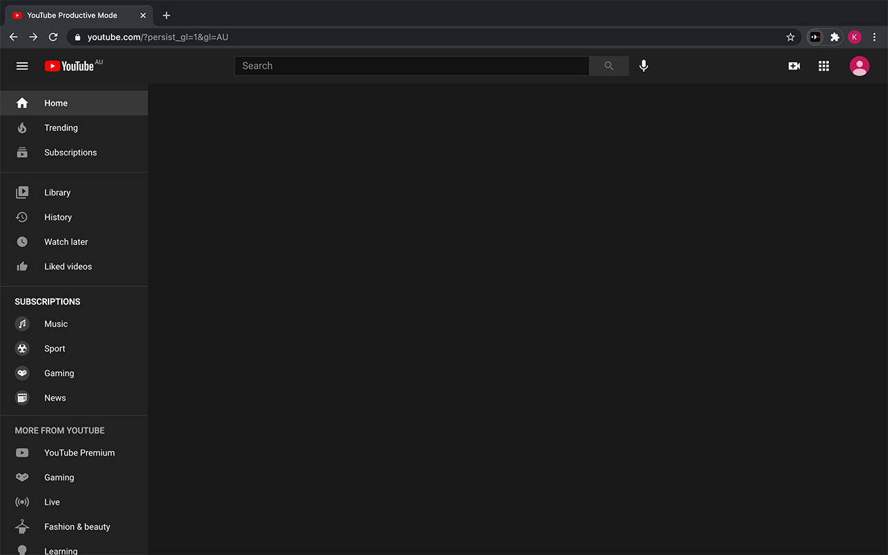

# YouTube Distraction Disabler
Remove distracting video suggestions on YouTube.

Just spent an hour on YouTube but still haven't got to the video that you set out to watch? Wanted to learn something on YouTube but always get distracted by your recommended feed? Fear no more, "YouTube Distraction Disabler" is here to remove all of the unrelated videos on YouTube and only show you what you want.

Finally got some free time and want to deliberately procrastinate on YouTube? That's ok too, just simply click the extension icon and turn off one of the options that you choose to block. The options are "Home", "Related", "Comments" and "Notifications", which corresponds to your home feed, related videos next to the video you're currently watching, the comments down below as well as the notification bell.



## Installation
### Download it on Chrome Web Store
1. Open Chrome.
2. Navigate to [Chrome Web Store](https://chrome.google.com/webstore/detail/youtube-distraction-disab/klhmhijgenkomhcobnbdnjkkefbghfab?hl=en-GB).
3. Click *Add to Chrome*

### Use the zip file
1. Download the zip file of a particular version from one of the following places:
    * Inside the directory `deployment`.
    * The first zip file under assets within `Releases`.
2. Open Chrome.
3. Navigate to `chrome://extensions`.
4. Enable *Developer mode*.
5. Click *Load unpacked*.
6. Select the unzipped directory.

### Build it yourself
Clone the project by running one of the commands below
```sh
git clone git@github.com:Kaiqi-Liang/YouTube-Distraction-Disabler.git
```
```sh
git clone https://github.com/Kaiqi-Liang/YouTube-Distraction-Disabler.git
```

Navigate to the project directory and install the dependencies

```sh
cd YouTube-Distraction-Disabler
npm install
```

If `typescript` is already installed then skip this step, otherwise intall it via

```sh
npm install typescript
```

To build the extension, and rebuild it when the files are changed, run

```sh
npm start
```

To build the extension for deployment, run

```sh
npm run build
```

After the project has been built, a directory named `dist` has been created. You have to add this directory to your Chrome browser:

1. Open Chrome.
2. Navigate to `chrome://extensions`.
3. Enable *Developer mode*.
4. Click *Load unpacked*.
5. Select the `dist` directory.
